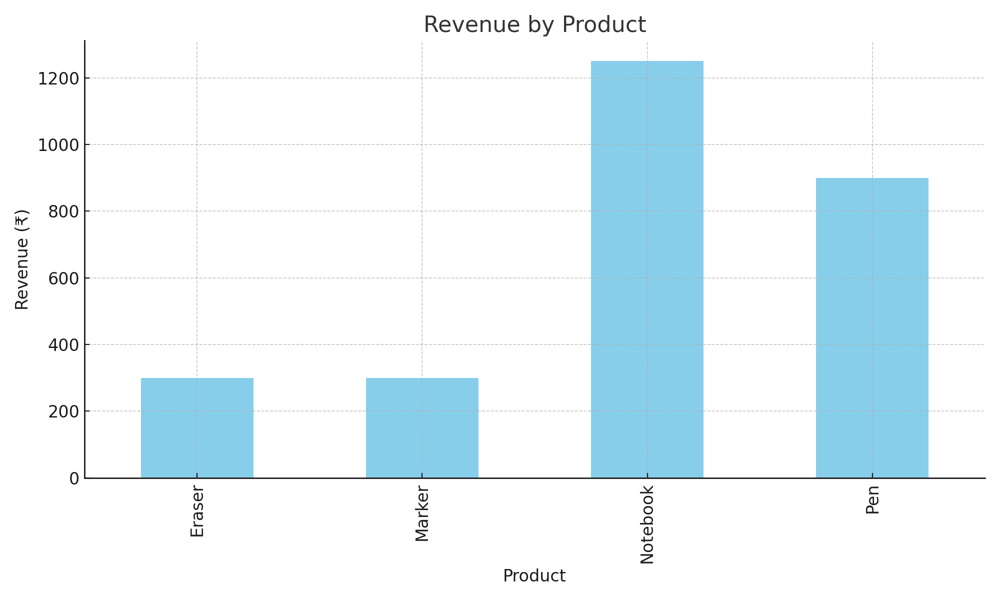

#  Task 7: Sales Summary Using SQLite in Python

This task demonstrates how to use SQLite with Python to generate a basic sales summary, including total quantity and total revenue per product. The output is displayed in the console and visualized with a bar chart.

---

##  Objective

- Create and connect to an SQLite database (`sales_data.db`)
- Insert dummy sales data
- Use SQL to query total quantity and revenue grouped by product
- Display results using `print()` and visualize using `matplotlib`

---

##  Tools Used

- Python (v3+)
- sqlite3 (built-in)
- pandas
- matplotlib

---

##  Files Included

| File Name            | Description                             |
|----------------------|-----------------------------------------|
| `task7_sales_summary.py` | Main Python script                   |
| `sales_data.db`      | SQLite database file                    |
| `sales_chart.png`    | Bar chart showing revenue by product    |

---

##  Sample Output

**Sales Summary Table:**

| Product   | Total Quantity | Revenue (₹) |
|-----------|----------------|-------------|
| Eraser    | 60             | 300.0       |
| Marker    | 20             | 300.0       |
| Notebook  | 50             | 1250.0      |
| Pen       | 90             | 900.0       |

---

##  Visualization

---

##  Outcome

- Practiced SQL inside Python using SQLite
- Loaded results into pandas
- Created a sales chart using matplotlib

